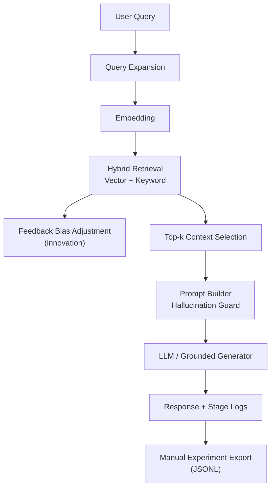

## Architecture and System Design
## Name:FAMOUS AKPOVOGBETA
## Index Number: 10211100297

### High-Level Data Flow

### Components
- **Ingestion Layer**
  - Downloads CSV + PDF, extracts text, and normalizes content.
- **Chunking Layer**
  - Character-based chunking with overlap for continuity.
- **Embedding Layer**
  - SentenceTransformer creates normalized embeddings.
- **Retrieval Layer**
  - Cosine similarity + keyword overlap combined with weighted scoring.
- **Prompt Layer**
  - Injects selected context and strict fallback rule for uncertain answers.
- **Evaluation Layer**
  - RAG vs no-retrieval baseline panel, adversarial query panel, and response consistency score.
- **Innovation Layer**
  - Source-feedback bias (`Helpful/Not helpful`) updates source score offset for future retrieval.
- **Presentation Layer**
  - Streamlit UI shows answer, retrieved chunks, scores, and final prompt.

### Why this design fits the domain
- The exam datasets are mixed-format (tabular + long-form policy document), requiring flexible ingestion.
- Manual retrieval logic enables transparent debugging and evaluation.
- Hybrid retrieval helps with policy jargon and election-specific terms.
